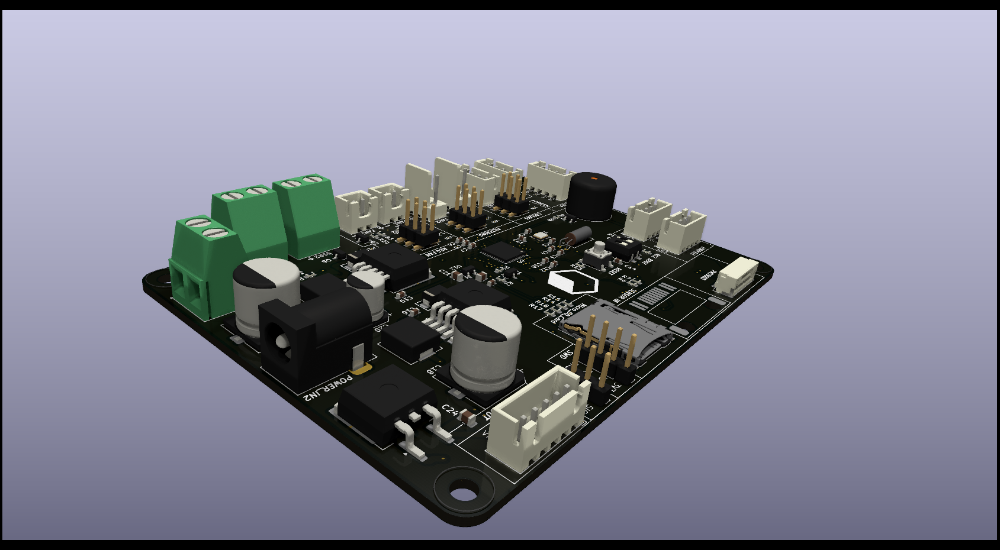

# Mainboard + Sensorboard

Open hardware KiCad 9 designs for a two-board set: an STM32F411-based **mainboard**
that handles power, control and I/O, and a companion **sensorboard** carrying the
gas/smoke sensing front end. The two connect over an RJ45 link.



## Boards

| | Mainboard | Sensorboard |
|---|---|---|
| Size | 120.05 × 90.05 mm | 73.04 × 50.07 mm |
| Copper layers | 4 (F.Cu, In1 GND, In2 VIN, B.Cu) | 2 (F.Cu, B.Cu) |
| Thickness | 1.6 mm | 1.6 mm |
| Placements | 174 | 22 |
| Revision | Rev-B | Rev-B |

### Mainboard

- **MCU** — STM32F411CEU6, 25 MHz HSE + 32.768 kHz LSE crystals, SWD header, BOOT jumper
- **Storage** — micro SD card slot, AT24CS64 I²C EEPROM
- **Power** — 12 V input via barrel jack / screw terminal, LM2596 switchers for 12 V and 5 V rails,
  SY8120B for 3V3, dedicated +5 V servo rail, fuse and reverse-protection diode
- **I/O** — RJ45 to the sensorboard, HX711 load-cell interface, PMS5003 particulate sensor header,
  three fan channels (60 mm, 140 mm, regulator fan) with MOSFET drive and tach/PWM,
  servo output, 5 V SSR terminal, WS2811 LED strip, buzzer, display header, DHT11, DIP + push switches
- **Protection** — PESD/BSD TVS arrays on the exposed interfaces

### Sensorboard

- MEMS smoke sensor, electrochemical smoke sensor and an optical channel
- LM317 (SOT-223) and SSP7901P33MR regulation
- WS2811 addressable LED
- RJ45 back to the mainboard, screw terminal sensor output, jumper-selectable options

## Repository layout

```
kicad/                  KiCad 9 source — open a .kicad_pro here
  mainboard.kicad_pro / .kicad_sch / .kicad_pcb
  sensorboard.kicad_pro / .kicad_sch / .kicad_pcb
  SensorBoard.kicad_sch    shared hierarchical sub-sheet
  power.kicad_sch          shared hierarchical sub-sheet
  3dmodels/                see note below
3d/mainboard.step          assembled 3D model
images/                    board renders
```

## Opening the projects

Both projects target **KiCad 9.0**. Open `kicad/mainboard.kicad_pro` or
`kicad/sensorboard.kicad_pro`. All symbols and footprints are cached inside the
`.kicad_sch` / `.kicad_pcb` files, so the boards render and plot correctly on a
stock KiCad install with no extra libraries.

A handful of symbols and footprints originate from custom libraries
(`custom_Library`, `custom`, `board`, `CustomFootprint`, `PESD5V0S1BA`,
`74HCT1G125GW`). Those libraries are not part of this repository, so KiCad will
report them as missing if you use *Update Symbols/Footprints from Library*. Normal
editing, plotting and DRC are unaffected.

## Manufacturing

Go to the production folder in the main repo.